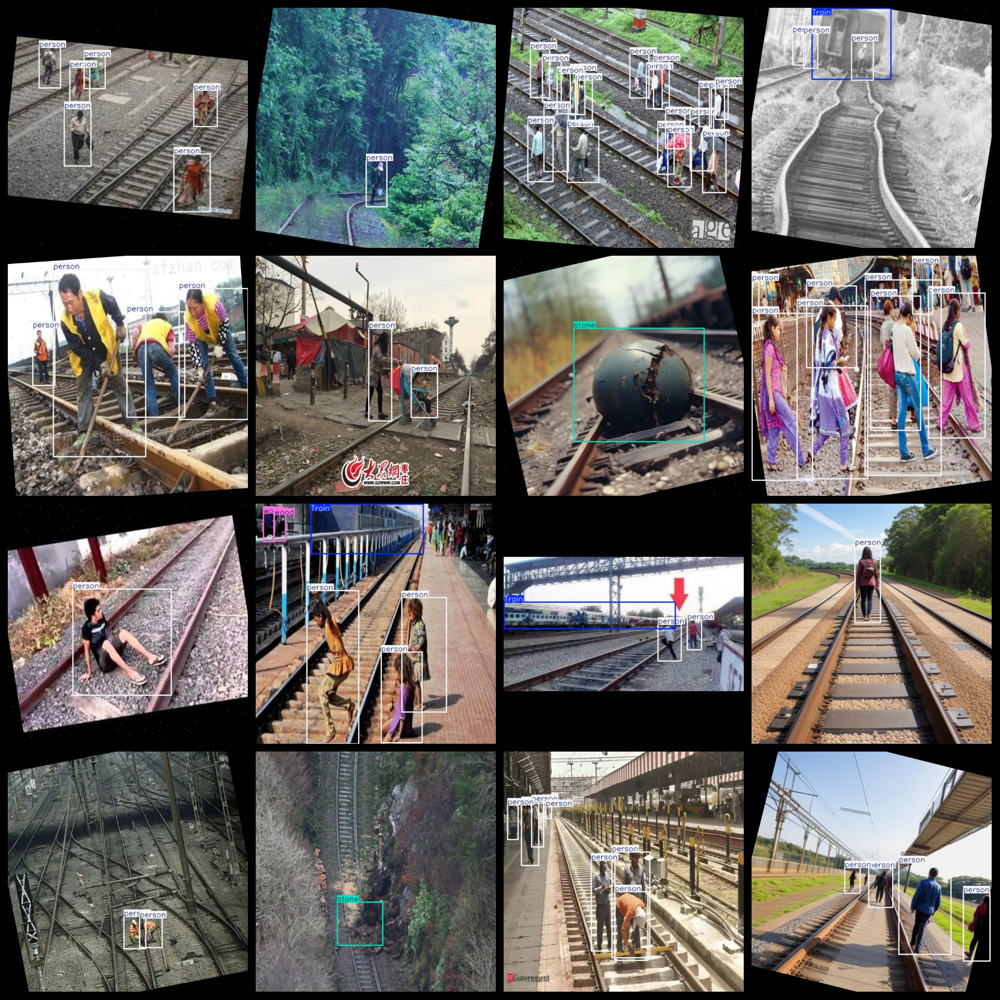

# [Object Detection] Fire Truck Track Foreign Object Detection Dataset - 504 images in YOLO+VOC format

**[Object Detection]** The Fire Truck Track Foreign Object Detection Dataset consists of 504 images in both YOLO and VOC formats.

The dataset format includes both VOC and YOLO formats.

The compression package contains three folders, each storing images, xml, and txt files.

In the JPEGImages folder, there are a total of 504 jpg images.

The Annotations folder contains a total of 504 xml files.

The labels folder contains a total of 504 txt files.

There are a total of 6 label categories: ["Train", "motorbike", "person", "stone", "vehicle", "wood"].

The labels are as follows: [“train”, “motorcycle”, “person”, “stones”, “vehicles”, “wood”].

For each category, there are different number of boxes (the order of boxes in the YOLO format may not match this, but it is based on the classes.txt in the labels folder):

- Train boxes: 87
- Motorbike boxes: 30
- Person boxes: 1494
- Stone boxes: 177
- Vehicle boxes: 48
- Wood boxes: 57
- Total boxes: 1893

The resolution of the images is clear, with a high level of detail.

The images have been enhanced.

The shape of the labels is rectangular boxes, used for object detection recognition.

Important notes: There are no guarantees regarding the accuracy or precision of the trained models or weight files. This dataset only provides accurate and reasonable annotations.
## Images

---

Here is a pay link on Stripe (https://buy.stripe.com/3cs8yP7sY87d0vu9AB). Please contact me lonlonago@foxmail.com after funding $89, and I will send you a complete data files, thank you!

